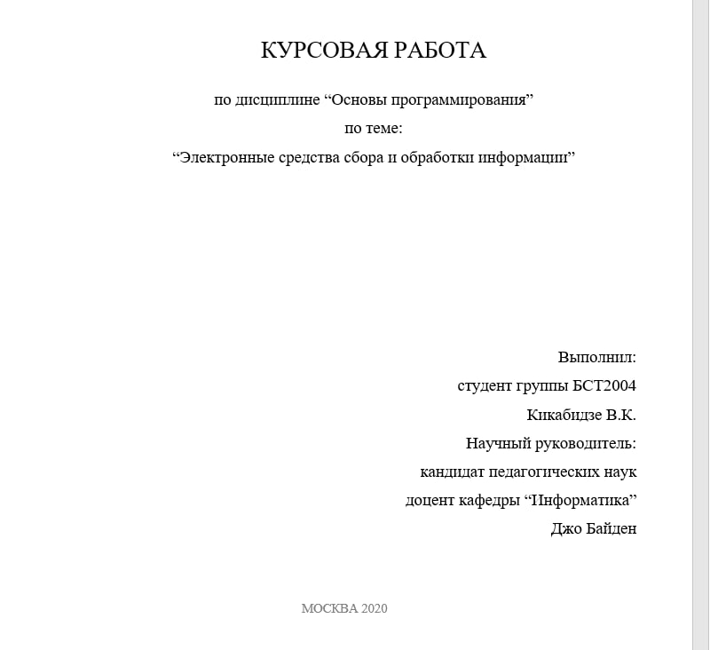
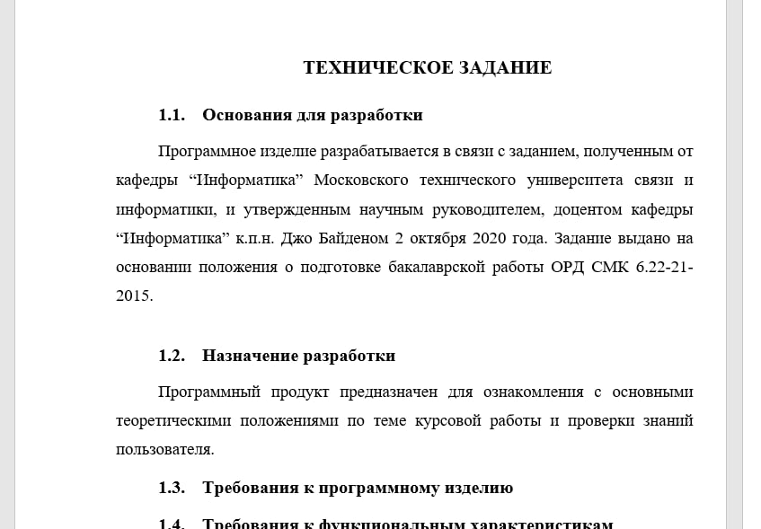
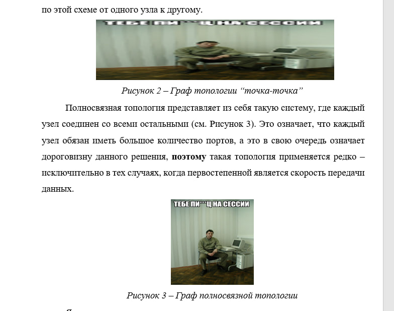

# studfile-process
<p align="justify">
Это программа, которая пробегает по всем файлам в указанной при запуске или в коде директории и заменяет текст, включая названия файлов,сообразно правилам, установленным в файле dict.json
А еще она заменяет все изображения в docx файлоах на мем с Гуриковым С.Р., если в пути к этим файлам присутствуют слова `"Основы Программирования"` или `"Информатика"`
Основной use-case — анонимизация своих Word файлов. Или просто для лулзов. 
</justify>

## Инструкция по запуску:
Для того, чтобы собрать бинарник, запускаем команду:
  ``` 
  go build -o ./bin/walker.exe ./file_walker/main.go
  ```

- Если запускать бинарник, то нужно, чтобы рядом с **walker.exe** была папка **МТУСИ**, а в ней нужные файлы.
- Если запускать через командную строку, то команда:  
  ``` 
  start main.exe -Labs "ПУТЬ до папки, которую будем перелопачивать"
  ```
  
- архиважно, чтобы рядом с **walker.exe** лежал **dict.json**
Самих себя можно добавить в **dict.json** с помощью блокнота или любой IDE.
Рекомендую добавлять несколько вариантов, так как зачастую ппрограмма улавливает только фамилию без инициалов, к тому же нужно учесть букву `ё`.
 <br /> 

 ## Результат работы

 
  
   

 ## Тот самый мем
 
